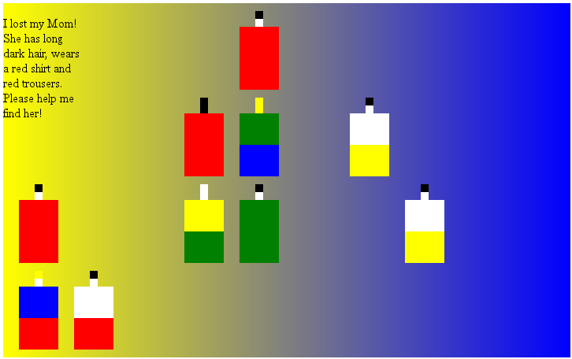

This repository will contain my contribution for the [Js13kGames competition 2017](http://2017.js13kgames.com/).

For now just the idea of my game: A child has lost his parents, and you have to find them. You get a description and then have to find them in a crowd.

The code isn't in a shape to share it yet, but I already have screenshot of the prototype:

