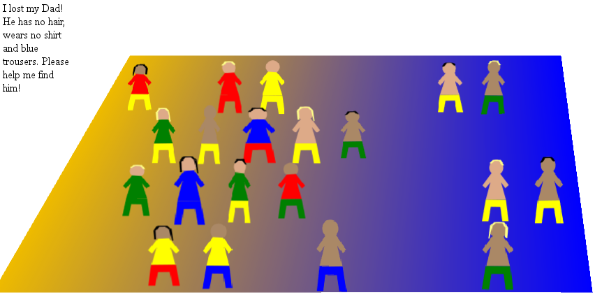

# About the game “I’ve lost my parents!”

The most important user of my programs, and actually the only one that really has to be satisfied with it, is me. This doesn’t mean that I develop my programs only for myself. I usually try to make them work for everybody, add localisations, etc. But it’s still me who’s the most important user. If a program I developed works for others, too: Great! But if it doesn’t, I probably wo’n’t do much about it. As you can see from my other Github repositories, I developed quite a lot of apps for Firefox OS. So, though most of them can be used as webapps on other systems, too, (which I never really tested, because I just don’t need it yet) it’s not unlikely, that I’m not only the most important user, but actually the only one. I also developed quite a lot of user scripts on Wikipedia, which are used by more users, but even there I tend to develop my scripts mainly for myself. So, even though I know that others will play my game and judge it, I still developed it with the idea, that I am the one who will play it most, and I have to like it (though I do hope, others will like it, too).

I’m actually neither a gamer, nor a game developer, though I do play games and have developed games. This means that I don’t like some popular types of games: I don’t like shooting games, I don’t like games where you have to think and react fast (as opposed to games where being fast isn’t strictly necessary and only increases your score). I really like puzzle games, but developing such a game is really hard, because this usually means that you know the solution, and this makes the game boring for you. So, why should I participate in a game developing contest? Well, mainly to have a bit of fun. Others spend their holidays in foreign countries to forget about their normal every-day life, I spend them doing something I usually don’t do.

## First ideas

My first idea actually was a augmented reality game, where your smartphone simulates a bucket of water, which you have to carry some distance without losing too much water. But I didn’t really like the idea debugging such a game, so I decided against it. Additionally, http://js13kgames.com uses HTTP, so the Geolocation API and some other APIs wo’n’t be available anyway. The second idea was about a person who has lost his glasses or some other stuff and asks you for help, so you have to search cupboards, drawers, etc. for it. From there it was only a small variation to my final idea: Children have lost their parents on the beach, and you have to find them.

## Early prototypes

I quickly developed the first prototype, still in 2d, and with very rectangular persons. Here is a screenshot from this prototype:

Actually, the code of the prototype and the code of the final game are very similar. The main changes occurred in the SVG files (with several stages between), but the JS code didn’t change much from its first version.

The second prototype already was in 3d, and had very roughly sketched persons:

I added the intro and the end screen, and after 2 weeks, I already had a playable game:

Later, I added sounds, the ability to skip a round, better SVGs, and polished the game.

## Decisions

While most of how the game should work was obvious to me, some decisions could have been different:

* The description of the missing parent is only given in text. I thought about giving the child the same look, but I decided against this. So you are really forced to read, and translate the text into an image, which activates more parts of your brain, giving you a bit of brain training while you play. This decision might be unpopular (even I sometimes disliked it during testing the game), but I still think it was the right decision.
* The number of persons increases via a logistic function. Originally, it increased linear (3 persons per round), but this took too long to get you to the more challenging crowded beaches. For the length of a game I used 3 minutes from the beginning, I once tried with 4 minutes, but this seemed too long to really concentrate until the end.
* I decided to allow skipping a round (originally, because it sometimes was impossible to click the right person, even if you found them, a bug that should be fixed now), but added an increasing waiting time as penalty. To make it impossible to just click on all people, I added an automatic skip (with the same penalty) after 3 wrong clicks.
* Personally, I don’t like sounds in games, and just mute them when they have any. But I acknowledge that others think them almost necessary, so I added a generated ocean sound, some plings, and a "Thank you" generated by speech synthesis. I’m not perfectly happy with them, but I couldn’t think of anything more satisfying.
* I spent a lot of time with details. The most obvious example of this are the SVG files (you can view them all in [svg.html](https://schnark.github.io/js13kgames-2017/svg.html)), but I also researched about the average height of men and women, girls and boys, typical numbers for waves per minute, etc. Probably, it would have been better if I hadn’t spent that much time about it, as most of this ca’n’t be noticed anyway.
* The SVG files are (at least most of them) created by re-drawing various photos. The combination of realistic proportions with flat colors (plus the gradient on the ball, which looked awful with flat colors) is a bit strange, but since I’m not an artist, I couldn’t do better. So I decided to keep the images as they are now, though moving to a more comic-like style would probably have improved them.

## Minifying

I used http://petercollingridge.appspot.com/svg-editor to minify the SVG files. In the beginning I had lots of space left, so I got a bit careless. During the first weeks I actually didn’t need minification (and it doesn’t do very much even now), so I decided to do it manually once at the end, using some online tools.

## Conclusion

I worked with some technologies I never worked before, at least not very much, and it’s great I now know them a bit better:

* SVG files are great. It’s easy to create them by drawing on top of a template, and with the right tools, you can remove all those strange stuff Inkscape puts in.
* With a single SVG file and different CSS, you can get quite a lot of variations.
* With SVG files, all values of `pointer-events` work, so mouse clicks can pass through transparent parts, unlike as in pure HTML.
* 3d transforms are great. Of course, they ca’n’t compete with WebGL, but they are really easy to use. Note, though, that you might run into browser bugs, even with modern browsers.
* WebAudio is hard to use. The basic concepts are easy, but how do you come from “I want a great sound” to “combine these oscillators that way”?
* Speech synthesis is fun. At least if you don’t try to go beyond simple things.
* Usually, I spent a lot of time to think the project over before I start coding. Due to the strict time limit this wasn’t possible here, but I learnt that it is a reallay good idea otherwise.
* I had a lot of fun developing this game, and I hope you enjoyed it, too!